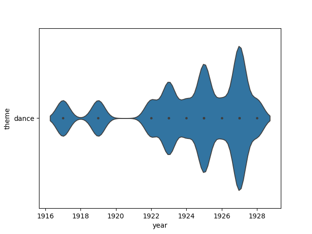
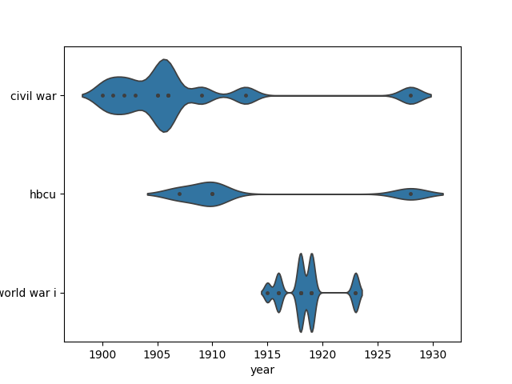

```python

```

\begin{center}
\begin{huge}
DATA203 Foundational Python (Prof. Maull) / Fall 2025 / HW4
\end{huge}
\end{center}

| Points <br/>Possible | Due Date | Time Commitment <br/>(estimated) |
|:---------------:|:--------:|:---------------:|
| 25 | Thursday, December 5 @ midnight | _up to_ 15 hours |


* **GRADING:** Grading will be aligned with the completeness of the objectives.

* **INDEPENDENT WORK:** Copying, cheating, plagiarism  and academic dishonesty _are not tolerated_ by University or course policy.  Please see the syllabus for the full departmental and University statement on the academic code of honor.

## OBJECTIVES
* Continue the African-American poetry digital humanities exploration in Python and Pandas.

* Explore thematic shifts over time.

* Build a supervised learning poem classifier.

## WHAT TO TURN IN
You will enjoy the highest benefits of the starter notebook
if you clone the HW Github repository from your Jupyter Hub
terminal with the command:

```bash
  git clone https://github.com/kmhuads/f25_data203.git
``` 

If you have already cloned the notebook, go to the folder
where you cloned it, open your Jupyter terminal, and
type:

```bash
git pull
```

This will ensure you have the most updated files and starter 
notebook.

Once you have cloned or pulled the repository, you can edit the
starter notebook with your solution code.

When you are done with your work, it will be best to zip
your `hw2` folder and all sub-folders with the terminal command
(one level outside your notebook folder):

``` bash
  zip -r data203_hw4_maull.zip ./hw4
 ```

This will produce the file with all necessary supporting files
(notebooks, data output, etc.) 
then
download it from the Jupyter Hub to your local machine, 
then upload the `.zip` to Teams.

If are confused on how to do this, please ask, 
or visit one of the many tutorials
on the basics of using zip in Linux.  

If you choose not to use the provided notebook, you will still need to turn in a
`.ipynb` Jupyter Notebook and corresponding files according to the instructions in
this homework.


## ASSIGNMENT TASKS
### (35%) Continue the African-American poetry digital humanities exploration in Python and Pandas. 

Last time we learned a lot about 
the  African American Poetry: A Digital Anthology
dataset and research.

We loaded the dataset and started some exploratory
inquiry into it.

This time we are going to go deeper into the text and 
eventually end up building a rudimentary model
to classify the poems

As the English language continued to grow concommitant
with the increase in literacy in the United States,
influences can be seen on writing -- whether novels,
poems, newspaper articles or personal letters.

We will withhold interest in the historical trajectory
of  African-American literacy and AAVE 
(African-American Verncular English)
among postbellum African-American writing, but we will
not curb our curiosities at a high level --  we have a 
limited dataset and quite some scholarly na&#239;vet&#233; in
this research area (but we can still have fun exploring).

**&#167; Task:**  **1.1 Explore poem length changes over time.**

In this part you will write a function `mean_word_count()`.

It will take a the  DataFrame -- the same one
as before.  This time, though, the function
will return the mean word count for the `text`
column of the dataset.

**NOTE:** To get 
an accurate word count, you will need to 
remove punctuation.  **Use the code you wrote in HW2** 
to properly remoce punctionation, otherwise you will lose some points
for the wrong answer.

Here is the detailed function requirement specification:

_function_ **NAME**: `mean_word_count`


_function_ **INPUT**

  - a Pandas DataFrame (the Poetry dataset from HW3)

_function_ **OUTPUT**

  - `None` if the mean cannot be computed,
  - otherwise, the mean word count of the `text` column of the dataset

_Code Example_:
```python
  df = pd.read_csv( [the HW3 poetry dataset] )
  mean_word_count(df)
```

_Output_:
```python
  122.3
```


**&#167; Task:**  **1.2 Write a second function `median_word_count()` which computes the median word count.**

This will be a very simple change to your `mean_word_count()` code.


**&#167; Task:**  **1.3 Write a third function called `word_count()` which takes and additional parameter, `method`, which can take one of two string values `"mean"` or `"median"`.**

There are a lot of ways to do this, but one way is to just
embed and call the functions you've already written based on the value of `method` (using
`if..else`).

Here is the function requirement specification:

_function_ **NAME**: `word_count`


_function_ **INPUT**

  - `df`: a Pandas DataFrame (the Poetry dataset from HW3)
  - `method`: a string that takes one of two values (`"median"` or `"mean"`)

_function_ **OUTPUT**

  - `None` if the method cannot be computed,
  - otherwise, the mean or median word count of the `text` column of the dataset based on the
    given `method`.

_Code Example_:
```python
  df = pd.read_csv( [the HW3 poetry dataset] )
  word_count(df, method="median")
```

_Output_:
```python
  120.7
```


**&#167; Task:**  **1.4 Use  `word_count()` to determine the word counts specified below:**

To complete the next part, please review the `DataFrame.query()` method.  You will need it!

**Show the code:**

1. to compute the word count for poems before 1910 (`year` is less than 1910),
2. to compute the word count for poems between 1910 and 1919,
3. to compute the word count for poems after 1919 (`year` greater than 1919).

**Answer:**

1. What general trend did you observe in word count?


**&#167; Task:**  **1.5 Plot the mean word counts for all years (1900-1928) using a bar plot.**

The $x$-axis is the year and $y$-axis the word count.

To complete this, you will need to:

1. learn to use [`DataFrame.groupby()`](https://pandas.pydata.org/pandas-docs/stable/reference/api/pandas.DataFrame.groupby.html),
2. learn to use [`DataFrame.apply()`](https://pandas.pydata.org/pandas-docs/stable/reference/api/pandas.DataFrame.apply.html) with `mean_word_count()` (not `word_count()` to simplify your life),
3. use [`DataFrame.plot.bar()`](https://pandas.pydata.org/pandas-docs/stable/reference/api/pandas.DataFrame.plot.bar.html).

**Answer:**

1. Did you learn anything new by plotting all years?


**&#167; Task:**  **BONUS:** Plot both mean and median word counts on the same bar plot.

This will be worth an extra 2 points.


### (35%) Explore thematic shifts over time. 


You, by now, have noticed that the `theme` column
of the data contains a large amount of useful 
information.

I have provided a function in the starter
notebook called `get_theme_tuples()` which 
takes a DataFrame and returns list of tuples 
of the form `(year, theme)`.  This list will 
become valuable to you for this part of the 
assignment.

**&#167; Task:**  **2.1 Convert the output of `get_theme_tuples()` to a proper DataFrame.**

This will require you create the DataFrame directly
from the tuple (as mentioned in lecture).  You 
may also want to use the [`DataFrame.rename()`](https://pandas.pydata.org/pandas-docs/stable/reference/api/pandas.DataFrame.rename.html) method
chained to the DataFrame to rename the
columns `0` and `1` to `year` and `theme`.

Your final DataFrame will look something like:

|    |   year | theme                            |
|:--:|-------:|:---------------------------------|
|  0 |   1900 | spanish-american war             |
|  1 |   1900 | empire                           |
|  2 |   1900 | slavery                          |
|  3 |   1900 | frederick douglass               |
|  4 |   1900 | civil war                        |
|  &#8230; |  &#8230; | &#8230;             |
  


**&#167; Task:**  **2.2 Make a Seaborn violin plot for the theme `"religion"`.**

Study violin plots here:

* [Seaborn violin plots documentation](https://seaborn.pydata.org/generated/seaborn.violinplot.html)

Your plot will look something like this (the example is for `"dance"`
which unsurprisingly shows an increase in dance
themes during the Harlem Renaissance):

 


**&#167; Task:**  **2.3 Write a function called `plot_themes` which takes the theme
DataFrame and a `theme_list` list as input and returns
the violin plot for all themes in `theme_list`.**

Do not overthink it.  The violin plot will do nearly
all the work for you.  You just need to make sure
that the DataFrame you send to it _only_ contains
the rows with the themes in `theme_list`.

Review [`DataFrame.query()`](https://pandas.pydata.org/pandas-docs/stable/reference/api/pandas.DataFrame.query.html) ... this is a one line code
implementation.

Here is the function requirement specification:

_function_ **NAME**: `plot_themes`


_function_ **INPUT**

  - `df`: a Pandas DataFrame of themes with columns `year` and `theme`
  - `theme_list`: a list of themes (e.g. `["hbcu", "world war i", "civil war"]`)

_function_ **OUTPUT**

  - an empy plot if the themes cannot be found,
  - otherwise, the Seaborn violin plot of the themes

_Code Example_:
```python
  df_themes = pd.read_csv( [the HW3 poetry dataset] )
  plot_themes(df_themes, theme_list=["labor"])
```

_Output_:
```python
# the Seaborn violin plot

```


**&#167; Task:**  **2.4 Plot the violin plots using your `plot_themes()` function.**

Produce the violin plot for:

* `theme_list=['harlem', 'africa', 'music', 'religion', 'racism']`

All of the plots will appear on the same graph like this example:

 


**&#167; Task:**  **BONUS:** (_up to +2 points_) Explain why there may be some issues
with the themes _as is_.  Provide concrete _examples 
and propose a solution on what to do about it.


**&#167; Task:**  **BONUS:** (_up to +2 points_) Write the code which provides the top 
15 most common themes over all years.


### (30%) Build a supervised learning poem classifier. 

We learned in lecture that 
predictions are the basis 
for machine learning algorithm.

Its nice to be able to predict the price 
of a house, the weather next week and 
even the outcome of the NBA finals.

Obviously, the more inputs there are 
in the system, the more complex
the model required to make a prediction.
The outcome of a football game, for example,
depends on so many more factors than 
is typical to account for, and furthermore
the inconsistency of human performance and 
randomness of other factors (e.g. fumbles,
in-game injuries, etc.) make accurate
predictions very difficult indeed.

We are going to leave those complex interactions
alone for now and work on a simple prediction model
using some Python libraries which 
with greatly simplify our efforts.

**&#167; Task:**  **3.1 Review `fasttext` and install `fasttext-numpy2` for text classification.**

[`fasttext`]() is an open source library 
developed by Facebook Research which provides
text classification tools that are accessible and 
easy to use.  Familiarize yourself with its capabilities 
here: 

* [`fasttext`: Library for fast text representation and classification.](https://github.com/facebookresearch/fastText)

Unfortunately, this module is no longer being maintained 
and as is, no longer works with the latest version
of Numpy (which is required for correct operation). This is 
the nature of open source software, for better or worse, but
it does not diminish its value or utility.

Instead of trying to roll back to an older and less
performant version of Numpy, we are going to rely 
on a fork of the `fasttext` libary which fixes 
it for the current version of Numpy.  This is 
the benefit of open source software -- those who can
fix things that the original developers do not,
can do so and allow others to benefit!

This library is called `fasttext-numpy2` and 
it can be found here:

* [`fasttext-numpy2`](https://github.com/simon-ging/fasttext-numpy2)  fork of `fasttext` by Simon Ging (thank you!)

Install  `fasttext-numpy2` with:

```python
  !pip install fasttext-numpy2
```


**&#167; Task:**  **3.2 Prepare a training dataset for `fasttext-numpy2`.**

In order to run the classifier you need two files: (1) a training set 
which contains the data which are labeled _examples_ of the 
classes you're trying to learn, and (2) an unlabeled test set of data 
which have not been seen by the classifier.

The unlabeled data will be assigned labels once the
classifier has been trained.

Use the provided function `make_training_set()` to 
make a labeled dataset.  Make sure your 
file is named `train.txt` (which is the default
file name in the provided function).

Now you will have a training set file.


**&#167; Task:**  **3.3 Use the provided `test.txt` file and `run_classifier()` function
  to produce a new DataFrame.**
  
  The output will contain the labels and confidence from the classifier.

  You may want to run the classifier like this:

  ```python
  df_clf = run_classifier()
  ```
  
  in order to obtain the dataset which
  contains labels of the unlabeled data
  within the `test.txt` file.  You will
  likely want to store this as a 
  variable so you can use it in the next part.


**&#167; Task:**  **3.4 Explain why you think the classifier is doing a good job or not.**

Take 2 random poems labeled `political` and 2 that are labeled `notpolitical`.

**HINT:** `df_clf.query('label="political"').sample(2)` will return 2 random  
poems classified `political`.

**Answer:**

For each poem print it in your notebook and explain why you 
think the label fits or does not fit.  There is an example
in the starter notebook on what this should look like.


